[](https://travis-ci.com/IBM/alexa-skill-watson-conversation)

# Create an Alexa skill using Watson Assistant and OpenWhisk

In this code pattern, we will create an Alexa skill using
[Watson Assistant](https://www.ibm.com/watson/ai-assistant/)
via the [Apache OpenWhisk](https://openwhisk.incubator.apache.org/) serverless framework.
Alexa is the voice service behind products like the Amazon Echo.
IBM Cloud Functions (based on Apache OpenWhisk) will be used to integrate Alexa
with Watson Assistant.
Credit goes to [Niklas Heidloff](http://heidloff.net/) for creating the original project.

An example conversation is included. You can also use this code pattern to try out a conversation from the
[Bot Asset Exchange (BAE)](https://developer.ibm.com/code/exchanges/bots/).

When the reader has completed this Code Pattern, they will understand how to:

* Create an OpenWhisk action in the IBM Cloud Functions serverless platform
* Store a session's Watson Assistant context across events
* Import a skill from the Bot Asset Exchange (BAE) or a JSON file
* Invoke a skill with Watson using Node.js
* Create an Alexa skill to reach tens of millions of customers

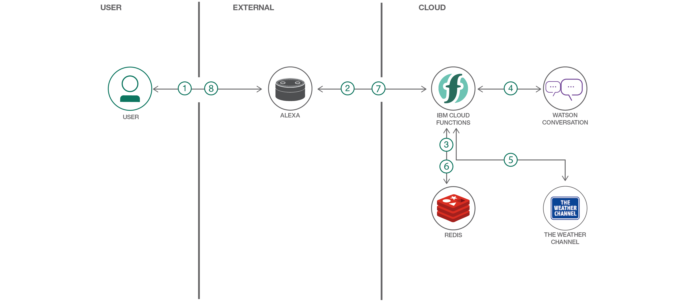

## Flow

1. User says "Alexa, ask Watson...".
2. Alexa invokes IBM Cloud Functions with input text.
3. The action gets a response from Watson Assistant.
4. The response text is sent back to Alexa.
5. Alexa replies to the user.

# Watch the Video

> Note: The video includes a demonstration with Weather data lookups and a Redis database for storing context. The current pattern has been simplified to use neither -- just a simple Watson Assistant skill with Alexa. The context is now stored in the Alexa session attributes.

[](https://www.youtube.com/watch?v=_iODArA1Eqs)

# Steps

## Run locally

1. [Clone the repo](#1-clone-the-repo)
1. [Create a Watson Assistant skill](#2-create-a-watson-assistant-skill)
1. [Configure credentials](#3-configure-credentials)
1. [Create the OpenWhisk action](#4-create-the-openwhisk-action)
1. [Create an Alexa skill](#5-create-an-alexa-skill)
1. [Talk to it](#6-talk-to-it)

### 1. Clone the repo

Clone the `alexa-skill-watson-assistant` repo locally and `cd` to the local repo
(for commands in later steps). In a terminal, run:

```bash
git clone https://github.com/IBM/alexa-skill-watson-assistant
cd alexa-skill-watson-assistant
```

### 2. Create a Watson Assistant skill

Sign up for [IBM Cloud](https://cloud.ibm.com/registration/) if you don't have an IBM Cloud account yet.

Use one or both of these options (with or without BAE) to setup an Assistant skill.

#### Using Bot Asset Exchange (BAE)

If you are using
[BAE](https://developer.ibm.com/code/exchanges/bots),
click on a `Deploy this bot` button to automatically create
your Assistant service and import your skill. The service will be named
`Bot Asset Exchange Workspaces` and can hold up to 5 selected skills.

#### Using the provided rent_a_car.json file

Create the service by following this link and hitting `Create`:

* [**Watson Assistant**](https://cloud.ibm.com/catalog/services/watson-assistant)

Import the Assistant rent_a_car.json:

* Find the Assistant service in your IBM Cloud Dashboard.
* Click on the service and then click on `Launch Watson Assistant`.
* Go to the `Skills` tab.
* Click `Create skill`
* Click the `Import skill` tab.
* Click `Choose JSON file`, go to your cloned repo dir, and `Open` the rent_a_car.json file in [`data/assistant/rent_a_car.json`](data/assistant/rent_a_car.json).
* Click `Import`.

To find the `SKILL_ID` for Watson Assistant:

* Go back to the `Skills` tab.
* Find the card for the workspace you would like to use. Look for `rent-a-car`, if you uploaded rent_a_car.json. The name will vary if you used BAE.
* Click on the three dots in the upper right-hand corner of the card and select `View API Details`.
* Copy the `Skill ID` GUID. Save it for the .params file in [Step 5](#5-configure-credentials).

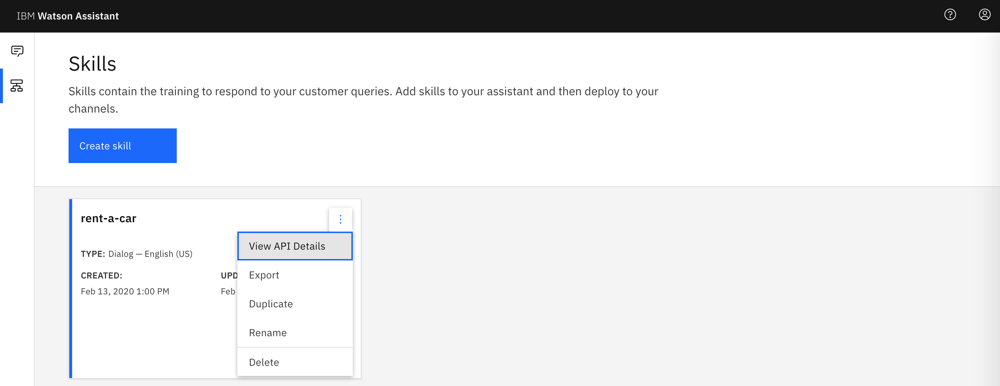

### 3. Configure credentials

The default runtime parameters need to be set for the action.
These can be set on the command line or via the IBM Cloud UI.
Here we've provided a params.sample file for you to copy and use
with the `-param-file .params` option (which is used in the instructions below).

Copy the [`params.sample`](params.sample) to `.params`.

```bash
cp params.sample .params
```

Edit the `.params` file and add the required settings as described below.

#### `params.sample:`

```json
{
  "ASSISTANT_APIKEY": "<add_assistant_apikey>",
  "ASSISTANT_URL": "<add_assistant_url>",
  "SKILL_ID": "<add_assistant_skill_id>",
}
```

#### Finding the credentials

The credentials for IBM Cloud services can be found in the IBM Cloud UI.

* Go to your IBM Cloud Dashboard.
* Find your Assistant service in the `Services` list.
* Click on the service name.
* `Manage` should be selected in the sidebar.
* Use the copy icons to copy the `API Key` and `URL` and paste them into your .params file.
* For `SKILL_ID`, use the Skill ID for Watson Assistant from [Step 2](#2-create-a-watson-assistant-skill).

### 4. Create the OpenWhisk action

As a prerequisite, [install the Cloud Functions (IBM Cloud OpenWhisk) CLI](https://cloud.ibm.com/docs/openwhisk?topic=cloud-functions-cli_install)

#### Create the OpenWhisk action

Run these commands to gather Node.js requirements, zip the source files, and upload the zipped files
to create a raw HTTP web action in OpenWhisk.

> Note: You can use the same commands to update the action if you modify the code or the .params.

```sh
npm install
rm action.zip
zip -r action.zip main.js package* node_modules
ibmcloud wsk action update alexa-watson action.zip --kind nodejs:default --web raw --param-file .params
```

#### Determine your IBM Cloud endpoint

To find this URL, navigate to [IBM Cloud Functions - Actions](https://cloud.ibm.com/openwhisk/actions), click on your
`alexa-watson` action and use the sidebar to navigate to `Endpoints`.

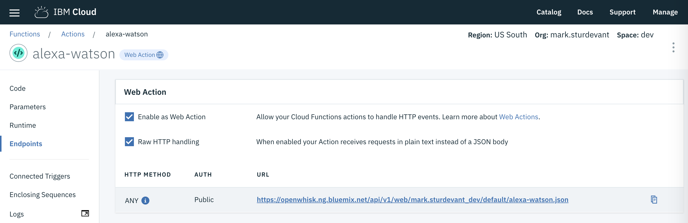

### 5. Create an Alexa skill

Sign up for an Amazon Developer Portal account [here](https://developer.amazon.com/).

Go to https://developer.amazon.com/alexa/console/ask and click the `Create Skill` button.


Provide a name, choose **Custom** model and hit the `Create skill` button.

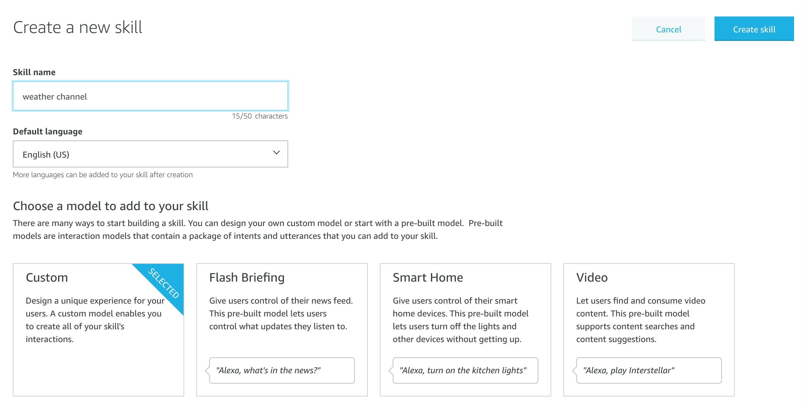

Select the **Start from scratch** template and hit the `Choose` button.

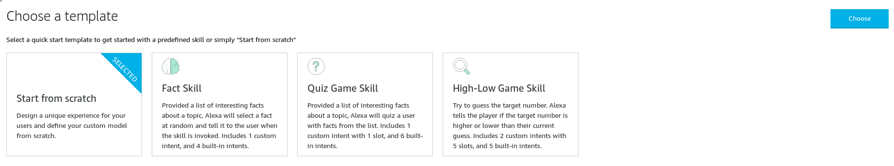

Provide an invocation name:

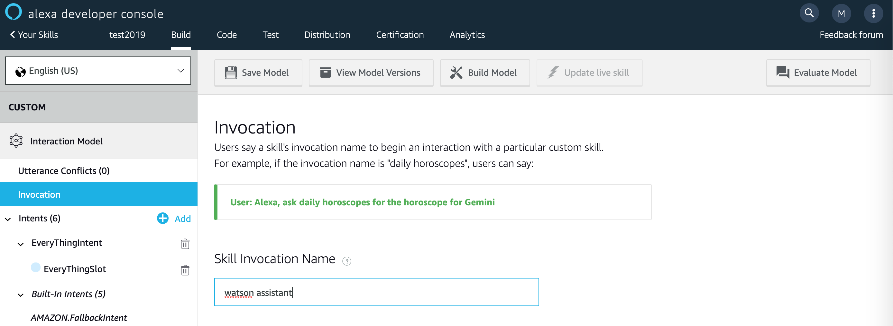

Add a custom slot type:

* In the left sidebar menu, click on `Slot Types (#)` and hit `+ Add`.


* Use the name `BAG_OF_WORDS` and hit the `Create custom slot type` button.


* Now `BAG_OF_WORDS` needs a slot value. Just enter `Hello World` and hit the plus sign so that it has a slot value.

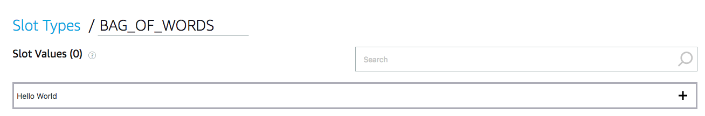

Add a custom intent type:

* In the left sidebar menu, click on `Intents (#)` and hit `+ Add`.


* Use the name `EveryThingIntent` and hit the `Create custom intent` button.
* Add `{EveryThingSlot}` under Sample Utterances. Use the plus sign to create the `EveryThingSlot`.

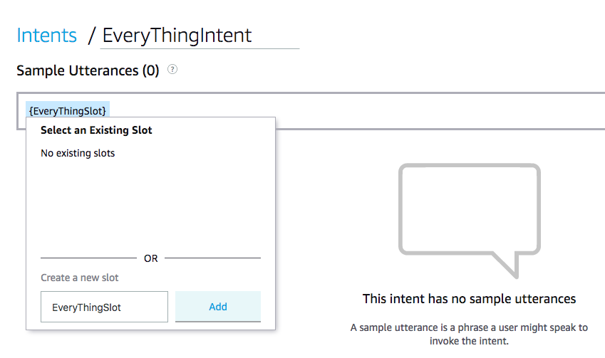

* Scroll down to `Intent Slots (#)`
* Use the `Select a slot type` pulldown to give `EveryThingSlot` the slot type `BAG_OF_WORDS`.

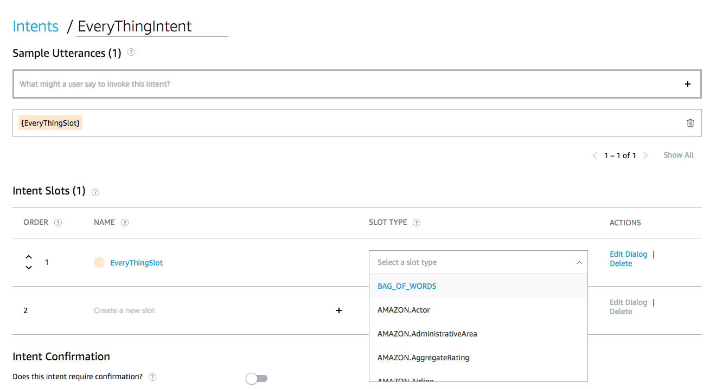

Click on `Save Model` and then `Build Model`.


Configure the endpoint:

* Click on `Endpoint` in the sidebar.
* Select `HTTPS` as the Service Endpoint Type.
* For the Default Region enter the **HTTPS** service endpoint which is the URL of your OpenWhisk **Web Action** from step 6.
* **Add a `.json` suffix to your service endpoint.**
* Use the pull-down to select `My development endpoint is a sub-domain of a domain that has a wildcard certificate from a certificate authority`.
* Click the `Save Endpoints` button!

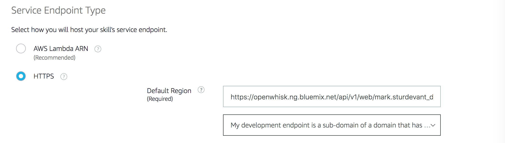

### 6. Talk to it

Use the `Test` tab in the Amazon developer console.

Use the drop-down to enable your skill for testing in `Development`. You can type or talk and test the skill in the test UI.

> Once enabled, you can run the sample via Alexa enabled devices, or the [Echo simulator](https://echosim.io/).

You can invite others to test it with the beta test feature. In order to be
eligible for beta test, you must fill out most of the publishing information.

You probably shouldn't publish this example, but you are now
ready to create and publish your own Alexa skill.

# Sample output

Here is a sample conversation flow using the provided Watson Assistant rent_a_car.json:

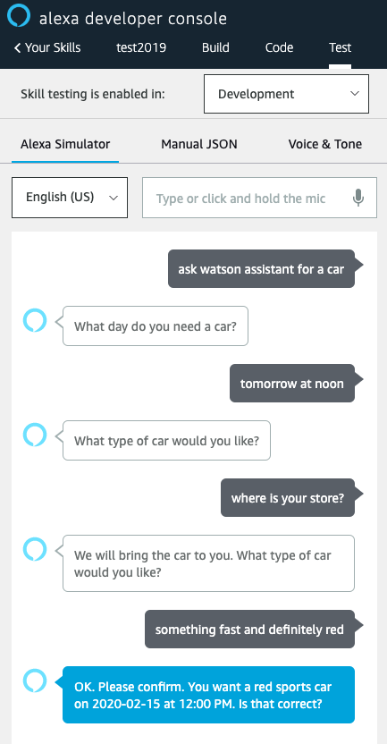

# Troubleshooting

* Want to see debug logging

  > Use the IBM Cloud UI to monitor logs, or use this CLI command to show the latest activation log:

  ```bash
  ibmcloud wsk activation list -l1 | tail -n1 | cut -d ' ' -f1 | xargs ibmcloud wsk activation logs
  ```

* Testing invoke from CLI

  > Use these commands to invoke the action (named alexa-watson in the example) without any input, then check the latest logs. **Expect an error ("Must be called from Alexa")**.

  ```bash
  ibmcloud wsk action invoke alexa-watson -bvd
  ibmcloud wsk activation list -l1 | tail -n1 | cut -d ' ' -f1 | xargs ibmcloud wsk activation logs
  ```

# License

This code pattern is licensed under the Apache License, Version 2. Separate third-party code objects invoked within this code pattern are licensed by their respective providers pursuant to their own separate licenses. Contributions are subject to the [Developer Certificate of Origin, Version 1.1](https://developercertificate.org/) and the [Apache License, Version 2](https://www.apache.org/licenses/LICENSE-2.0.txt).

[Apache License FAQ](https://www.apache.org/foundation/license-faq.html#WhatDoesItMEAN)
