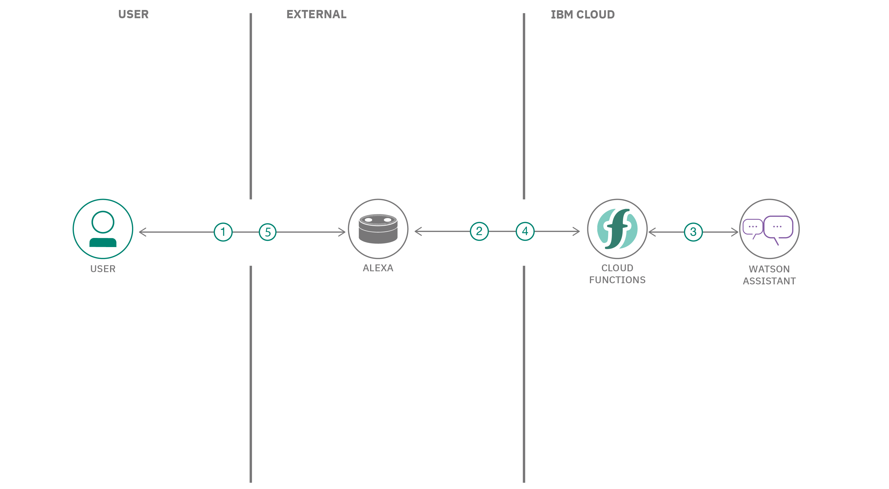

Create an Alexa skill using Watson Conversation and OpenWhisk
=============================================================

In this developer journey, we will create an Alexa skill using
[Watson Conversation](https://www.ibm.com/watson/developercloud/conversation.html)
via the [Apache OpenWhisk](http://openwhisk.incubator.apache.org/) serverless framework.
Alexa is the voice service behind products like the Amazon Echo.
IBM Cloud Functions (based on Apache OpenWhisk) will be used to integrate Alexa
with Watson Conversation. An example conversation is included to demonstrate
how to pass context between different intents. Credit goes to
[Niklas Heidloff](http://heidloff.net/) for creating the original project.

When the reader has completed this journey, they will understand how to:

* Create an OpenWhisk action in the IBM Cloud Functions serverless platform
* Use Redis to store a session's conversation context across events
* Invoke a conversation with Watson using Node.js
* Create an Alexa skill to reach tens of millions of customers 



## Flow
1. User says "Alexa, ask Watson...".
2. Alexa invokes IBM Cloud Functions with input text.
3. The action gets the conversation context from Redis (if any).
4. The action gets a response from Watson Conversation.
5. The response context is stored in Redis.
6. The response text is sent back to Alexa.
7. Alexa replies to the user.

## With Watson
Want to take your Watson app to the next level? Looking to leverage Watson Brand assets? Join the [With Watson](https://www.ibm.com/watson/with-watson) program which provides exclusive brand, marketing, and tech resources to amplify and accelerate your Watson embedded commercial solution.

## Included components

* [Watson Conversation](https://www.ibm.com/watson/developercloud/conversation.html): Create a chatbot with a program that conducts a conversation via auditory or textual methods.
* [OpenWhisk](https://console.ng.bluemix.net/openwhisk): Execute code on demand in a highly scalable, serverless environment.
* [Redis](https://redis.io/): An open-source, in-memory data structure store, used as a database, cache and message broker.

## Featured technologies
* [Serverless](https://www.ibm.com/cloud-computing/bluemix/openwhisk): An event-action platform that allows you to execute code in response to an event.
* [Databases](https://en.wikipedia.org/wiki/IBM_Information_Management_System#.22Full_Function.22_databases): Repository for storing and managing collections of data.
* [Node.js](https://nodejs.org/): An open-source JavaScript run-time environment for executing server-side JavaScript code.

# Watch the Video
<!--Update this section when the video is created
[](https://www.youtube.com/watch?v=Jxi7U7VOMYg)
-->
> Coming soon

# Steps

<!-- TODO: D2B
Use the ``Deploy to Bluemix`` button **OR** create the services and run locally.

## Deploy to Bluemix
[](https://bluemix.net/deploy?repository=https://github.com/IBM/watson-banking-chatbot.git)

1. Press the above ``Deploy to Bluemix`` button and then click on ``Deploy``.

2. In Toolchains, click on Delivery Pipeline to watch while the app is deployed. Once deployed, the app can be viewed by clicking 'View app'.


3. To see the app and services created and configured for this journey, use the Bluemix dashboard. The app is named `watson-banking-chatbot` with a unique suffix. The following services are created and easily identified by the `wbc-` prefix:
    * wbc-conversation-service
    * wbc-discovery-service
    * wbc-natural-language-understanding-service
    * wbc-tone-analyzer-service
-->

## Run locally
<!-- TODO: Revisit after adding d2b button.
> NOTE: These steps are only needed when running locally instead of using the ``Deploy to Bluemix`` button.
-->

1. [Clone the repo](#1-clone-the-repo)
1. [Create Watson services with IBM Bluemix](#2-create-watson-services-with-ibm-bluemix)
1. [Import the Conversation workspace](#3-import-the-conversation-workspace)
1. [Configure credentials](#4-configure-credentials)
1. [Create the OpenWhisk action](#5-create-the-openwhisk-action)
1. [Create an Alexa skill](#6-create-an-alexa-skill)
1. [Talk to it](#7-talk-to-it)

### 1. Clone the repo

Clone the `alexa-skill-watson-conversation` repo locally and `cd` to the local repo
(for commands in later steps). In a terminal, run:

```
$ git clone https://github.com/nheidloff/alexa-skill-watson-conversation
$ cd alexa-skill-watson-conversation
```

### 2. Create Watson services with IBM Bluemix

Sign up for [Bluemix](https://console.ng.bluemix.net/registration/) if you don't have a Bluemix account yet.

Create the following services:

* [**Watson Conversation**](https://console.ng.bluemix.net/catalog/services/conversation)
* [**Compose for Redis**](https://console.ng.bluemix.net/catalog/services/compose-for-redis)

### 3. Import the Conversation workspace

Launch the **Watson Conversation** tool. Use the **import** icon button on the right

Find the local version of [`data/conversation/workspaces/workspace.json`](data/conversation/workspaces/workspace.json) and select
**Import**. Find the **Workspace ID** by clicking on the context menu of the new
workspace and select **View details**. Save this ID for later.

### 4. Configure credentials

The credentials for Bluemix services (Conversation and
Compose for Redis), can be found in the ``Services`` menu in Bluemix,
by selecting the ``Service Credentials`` option for each service.

The other setting for Conversation was collected during the
earlier setup steps (``WORKSPACE_ID``).

The default runtime parameters need to be set for the action.
These can be set on the command-line or via the Bluemix UI.
Here we've provided a params.sample file for you to copy and use
with the `-param-file .params` option.

Copy the [`params.sample`](params.sample) to `.params`.

```
$ cp params.sample .params
```
Edit the `.params` file and add the required settings.

#### `params.sample:`

```json
{
  "CONVERSATION_USERNAME": "<add_conversation_username>",
  "CONVERSATION_PASSWORD": "<add_conversation_password>",
  "WORKSPACE_ID": "<add_conversation_workspace_id>",
  "REDIS_URI": "<add_redis_uri>"
}
```

### 5. Create the OpenWhisk action

#### Install the CLI
Install and test the IBM Cloud Functions CLI by following the steps documented [here](https://console.bluemix.net/openwhisk/learn/cli).

#### Create the OpenWhisk action
Run these commands to gather Node.js requirements, zip the source files, and upload the zipped files
to create a raw HTTP web action in OpenWhisk.

> Note: You can use the same commands to update the action if you modify the code.

```sh
$ npm install
$ zip -r action.zip * 
$ bx wsk action update alexa-watson action.zip --kind nodejs:6 --web raw --param-file .params
```

### 6. Create an Alexa skill
Sign up for an Amazon Developer Portal account [here](http://developer.amazon.com/).

Follow the instructions
[here](https://developer.amazon.com/public/solutions/alexa/alexa-skills-kit/docs/registering-and-managing-alexa-skills-in-the-developer-portal#register-a-new-skill)
to register your new skill using the `Alexa Skills Kit`.

Select `Custom Interaction Model` and choose a `Name` and `Invocation Name`.


Save and hit `Next` and then you will enter an `Intent Schema`, `Custom Slot Types` and `Sample Utterances`. We'll use a very minimal data here and let Watson Conversation do most of the work.

Copy the data from `data/alexa` to fill out these three sections.

#### Intent Schema

#### Custom Slot Types

#### Sample Utterances


On the configuration page you need to define an **HTTPS** service endpoint which is the URL of your OpenWhisk action ending with '.json'. To find this URL, navigate to the [OpenWhisk dashboard](https://console.bluemix.net/openwhisk/manage/actions), select your action and navigate to 'Additional Details'. Use the `Web Action URL`.


Hit `Next`. Under 'Certificate for DEFAULT Endpoint:' select the `My development endpoint is a sub-domain of a domain that has a wildcard certificate from a certificate authority` option.

Hit `Next` and your skill is ready for testing!

### 7. Talk to it

You can run the sample via Alexa enabled devices, or the [Echo simulator](https://echosim.io/) or the service simulator in the Amazon developer portal.

You can invite others to test it with the beta test feature. In order to be
eligible for beta test, you must fill out most of the publishing information.

You probably shouldn't publish this developer journey, but you are now 
ready to create and publish your own Alexa skill.

# Sample output

Here is a sample conversation flow:

- User: Alexa, ask my skill what do you know about me
- Alexa/Watson: I don't know anything about you. Where do you live?
- User: Berlin
- Alexa/Watson: Now I know you live in Berlin
- User: Alexa, ask my skill what is the weather
- Alexa/Watson: Looking up weather information for Berlin ...

The sample has been implemented via the new [slots filling](http://heidloff.net/article/conversation-watson-slots) functionality in Watson Conversation. The screenshot shows how the entity (slot) 'location' is defined as mandatory and how the value is stored in a context variable.


The next screenshot shows how the location is automatically used in the next 'weather' intent.


# Links
* [Watson Node.js SDK](https://github.com/watson-developer-cloud/node-sdk)

# Troubleshooting

* View the logs

  > Use this command to show the latest activation log:
  ```
  bx wsk activation list -l1 | tail -n1 | cut -d ' ' -f1 | xargs bx wsk activation logs
  ```

* View the logs

  > Use this command to show the latest activation log:
  ```
  bx wsk activation list -l1 | tail -n1 | cut -d ' ' -f1 | xargs bx wsk activation logs
  ```

* Invoke from command line

  > Use these commands to invoke the action (named alexa-watson in the example) without any input, then check the latest logs. Expect an error (no input), but if your credentials and default args are correct, you should see `Connected to Watson Conversation` and `Connected to Redis` in the log.
  ```
  bx wsk action invoke alexa-watson -dvr
  bx wsk activation list -l1 | tail -n1 | cut -d ' ' -f1 | xargs bx wsk activation logs
  ```

# License
[Apache 2.0](LICENSE)